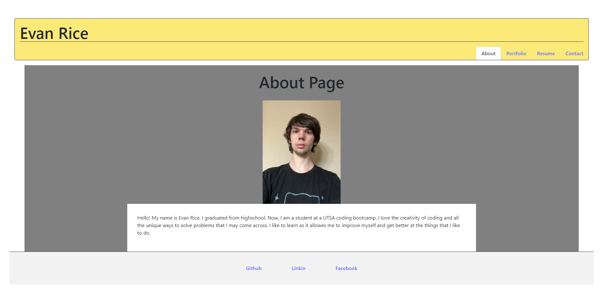

# ReactPortfolio

## Description

My motivation for creating this projest was to create a new updated portfolio using react. I made this project learn more about react and how it is used to create better websites. This solves the problem of having a outdated portfolio that does not show or use all the skills that I have acquired over this course. I learned from this project was how react is used to create websites.

## Usage

Link to website:(https://beamish-travesseiro-8df041.netlify.app/)
